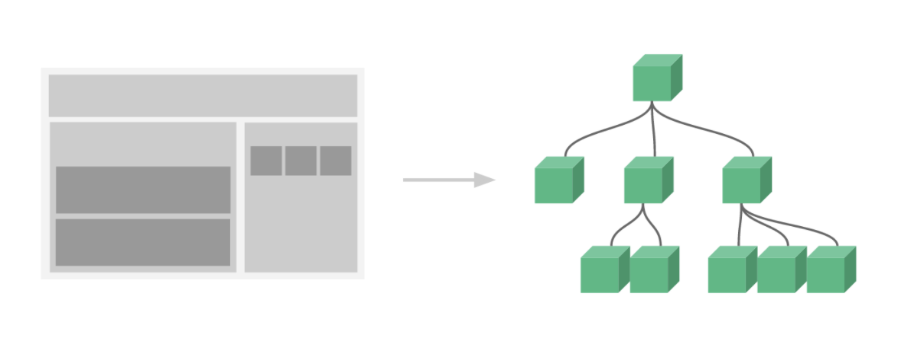
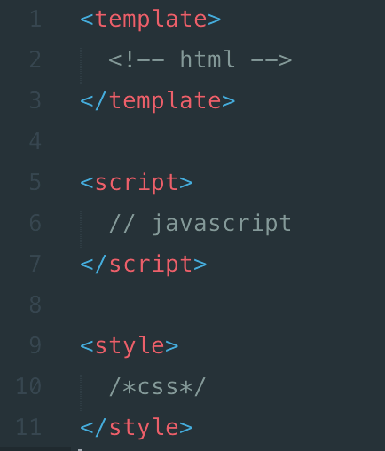

# Day02 - Web元件化系統

Web元件化系統是Vue.js一個很重要的概念，我們使用官網提供的一張圖來做詳細解釋



上方右圖是一個**樹狀結構**，Vue.js嚮往的就是先建立好根實體(Vue Instance)，再開發好底下每個小元件(Components)，慢慢往上組合成一個完整頁面，最後全部搭建起來成為一個完整專案。

每個元件部分獨立運作或相連，目的就是希望各元件之間互相干擾程度愈小愈好，如果是父層子層互相傳遞資料或則是重用已使用過的元件，Vue.js都有寫好的方法可以套用。

通常一個元件的html, css, js會全部寫在一個.vue為副檔名的檔案當中，vue-loader會編譯這個.vue的檔案，將結果顯示出來。一個.vue檔會有三個部分，`<template></template>`裡面寫html、`<script></script>`這個tag裡面寫js、`<style></style>`裡面寫css。



## 認識Vue Instance

根實體(Vue Instance)是樹狀結構中最上面的那個點，每個Vue App都是從創建一個vue instance開始，Vue Instance是透過Vue Constructor(建構式)所產生，在實體化時，可傳入一個**選項物件**(Options)，此物件包含這個vue instance需要用到的屬性，像是掛載點(el)、資料(data)、方法(methods)、模板(template)、生命週期鉤子(hooks)等等。

```
var vm = new Vue ({
    // options
})
```

上方為宣告一個vue instance，變數名稱為vm，vm是view model的簡稱，Vue Instance的設計概念來自[MVVM Pattern](https://msdn.microsoft.com/en-us/library/hh848246.aspx)。

Vue的MVVM架構如下圖，View與Model之間的溝通就透過ViewModel來互相傳遞資訊：


Web元件化系統是Vue.js最大的特色，Vue在執行創建到銷毀Vue Instance的時候會跑一個Lifecycle，下一篇我們會介紹Instance Lifecycle，後面文章中還會說明在Vue當中關於Vue.Component的語法與實作。

-----

### 參考資料
* [Vue.js官網](https://vuejs.org/)
* [Vue.js 學習筆記總整理 - Vue Instance](https://cythilya.github.io/2017/04/11/vue-instance/)
* [vue & vuex 07 - component - I (元件拆解，合併，靜態資料引用)](https://ithelp.ithome.com.tw/articles/10185457)
* [Vue js 大型專案架構](https://www.slideshare.net/hinablue/vue-js)