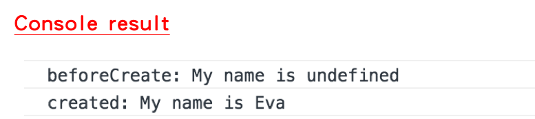
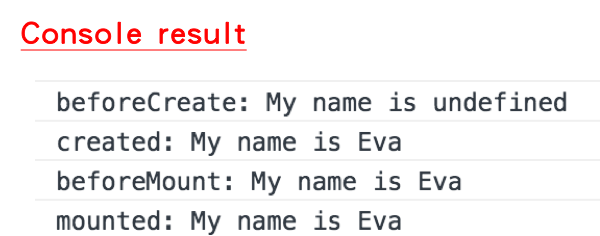
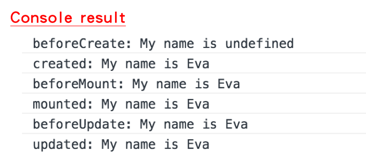
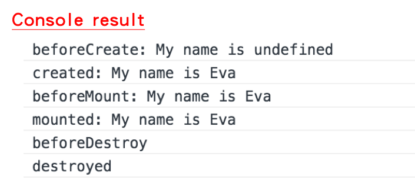

# Day03 - Instance Lifecycle

## 認識Instance Lifecycle與Instance Lifecycle Hooks


上圖為官網所繪製的Instance Lifecycle(生命週期)，Vue其實在我們下執行命令後，會做很多事情，因為它將資料(data)與UI樣板(template)綁在一起，開發者只需要宣告好資料、填入正確的UI components以及router的path設定好後，結果就會呈現。

而在我們執行後，Vue在這個Lifecycle中，會建立Vue Instance、綁定資料、事件配置、編譯樣板、經過無限修改更新資料等步驟，直到整個Vue Instance被銷毀(destroyed)，這個Vue Instance底下的資料、樣板、事件、元件才會解除綁定，完成一整個Lifecycle。

那什麼是Instance Lifecycle Hooks(生命週期鉤子)呢？看到上面的Lifecycle diagram，鉤子就是上圖虛線延伸出去白底紅字的8個方法，這些鉤子的用意是在Vue在Lifecycle中做每件事情的時機點前後，可以讓你有選擇處理的方式，相當客製化。

這8個鉤子的資料型態皆為`function`，以下我們就介紹這8個鉤子分別可以使用的時機

#### beforeCreate
在初始化vue instance並開啟整個Lifecycle後，資料綁定與事件配置之前。目前階段還無法調用$data。
應用場景：loading進頁面的事件

#### created
vue instance創建完成，$data已可以取得，屬性與事件也已綁定好。目前階段尚未掛載el，DOM也尚未生成。

#### beforeMount
在掛載el開始之前。目前階段是相關render函式首次被調用，尚未被DOM給綁定。

#### mounted
el被剛創建好的vm.$el替換取代，並且掛載到vm上。目前階段已被DOM綁定。
應用場景：對後端發出請求或讀取新資料

#### beforeUpdate
在資料更新時調用，Virtual DOM重新render與patch之前，可以在這個階段變更資料狀態。目前階段還不會繪製view。

#### updated
資料更新後會使Virtual DOM重新render頁面。目前階段會繪製出正確的view。

#### beforeDestroy
在vue instance被銷毀前調用。目前階段還可以完全使用這個vue instance。

#### destroyed
vue instance銷毀後可以調用，調用後這個vue instance底下的資料與樣板會解除綁定，事件會取消監聽，所有子元件也會被銷毀。

###### **Virtual DOM是用JavaScript物件來模擬DOM Tree，操作物件以提升效能。(下一篇Day04會再介紹Virtual DOM是什麼)

### 實作：實現Vue Instance Lifecycle Hooks
```javascript
var vm = new Vue({
    data: {
        name: 'Eva',
    },
    beforeCreate: function() {
        // vue instance尚未創建完成，還不能讀取到資料
        console.log('beforeCreate: My name is ' + this.name);
    },
    created: function() {
        // vue instance創建完成，資料已綁定
        console.log('created: My name is ' + this.name);
    },
    beforeMount: function() {
        // 尚未掛載el與綁定DOM
        console.log('beforeMount: My name is ' + this.name);
    },
    mounted: function() {
        // 綁定DOM之後
        console.log('mounted: My name is ' + this.name);
    },
    beforeUpdate: function() {
        // 資料更新時調用，尚未更新DOM
        console.log('beforeUpdate: My name is ' + this.name);
    },
    updated: function() {
        // 因為資料更新而更新DOM
        console.log('updated: My name is ' + this.name);
    },
    beforeDestroy: function() {
        // 銷毀整個vue instance之前
        console.log('beforeDestroy');
    },
    destroyed: function() {
        // 銷毀整個vue instance之後
        console.log('destroyed');
    },
});
```

我們分四階段來看

#### 第一階段：beforeCreate / created

在綁定el之前，beforeCreate階段還不能讀取資料



#### 第二階段：beforeMount / mounted

在程式碼下面加入這行程式碼

```javascript
vm.$mount('#app');
```

或者加入el屬性在物件裡

```javascript
var vm = new Vue({
  el: '#app',
  data: {
    name: 'Eva',
  },
  ...
});
```



#### 第三階段：beforeUpdate / updated

因為要變更資料才會觸發這兩個function，這邊我們使用強制變更資料

```javascript
vm.$forceUpdate();
```



#### 第四階段：beforeDestroy / destroyed

因為上面第三階段強制變更資料的方法會導致一直執行更新資料，所以先將剛剛新增的vm.$forceUpdate();刪掉，加入destroy的方法

```javascript
vm.$destroy();
```



總結來說，從Lifecycle可以觀察得出Vue的執行順序，對於Vue在執行後並顯示出結果的流程會比較熟悉。

-----

### 參考資料
* [Vue.js 17 - 生命週期(Lifecycle)](https://ithelp.ithome.com.tw/articles/10188213)
* [[Vue2.0] 搞懂生命週期 (LifeCycle)](http://blog.niclin.tw/posts/2809559-understanding-vue-lifecycle-hook)
* [Vue.js (8) - Vue 實體與生命週期](http://blog.tonycube.com/2017/04/vuejs-8-lifecycle.html)