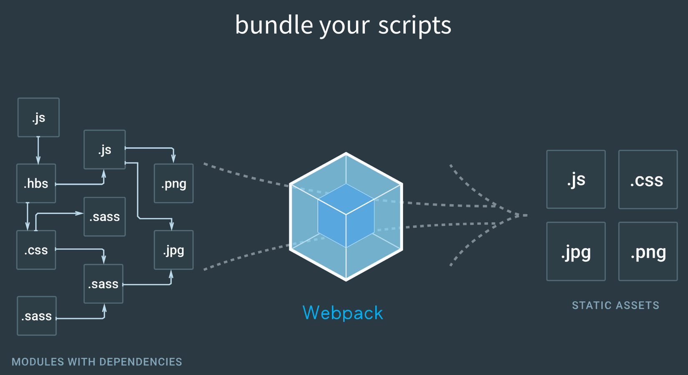
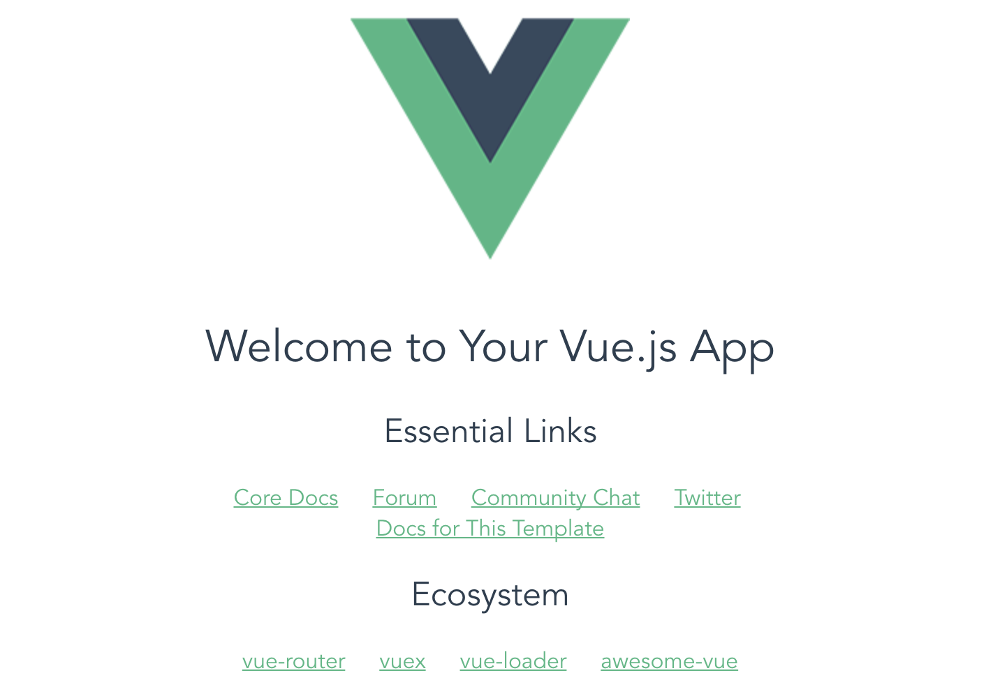

# Day05 - 建立環境與新增專案

大致了解Vue的一些比較重要特色之後，再來我們來看看怎麼建置Vue的環境與專案，要開始進行實作部分了。

## 建立環境

開始之前，電腦需要有**Node.js**環境與**NPM**(Node Package Manager)套件管理工具

* Node.js環境可到[官網](https://nodejs.org/en/)下載安裝包(目前npm已在安裝包的source裡有，不需另外安裝npm)
* npm可以自己更新自己
```
$ sudo npm update -g npm
```

裝好node環境與npm後，即可使用套件管理工具npm安裝好**Vue**環境
```
$ npm install vue
```

## 新增專案
透過npm全域安裝vue-cli，安裝完後即可使用vue指令
```
$ npm install -g vue-cli
```
###### ** -g 表示 --global，代表全域安裝

初始化專案
```
$ vue init [template] [project_name]
```
###### ** [template] 可以採用官方提供的幾種template，若不知道有什麼template，可以下指令查看

```
#查看官方提供的template與說明
$ vue list
```


以下使用webpack / webpack-simple來做範例專案。

### 快速建立專案：使用webpack / webpack-simple樣板

#### 認識webpack與vue-loader

* **webpack**是一個前端打包工具
* **vue-loader**是一個webpack的載入器(loader)，可將vue組件(.vue檔)轉換為JavaScript模組



#### 選用webpack的原因

* 找出各項靜態資源之間的關聯性與整合，使用vue-loader將它們模組化，產出優化過後的code
* **Hot-loader**：Hot-loader可以在修改與存檔好code後，就直接更新畫面，不需要按重新整理，相較live-reloader來說，方便許多

#### 建立新專案步驟

使用webpack初始化專案
```
$ vue init webpack [project_name]
```

或也可以使用較簡化的webpack樣板
```
$ vue init webpack-simple [project_name]
```

###### **在安裝過程中，會有許多設定跳出請你更改，如果不更改，按enter即設定成預設值。

進入專案資料夾
```
$ cd [project_name]
```

在專案資料夾底下，安裝所需要的模組
```
$ npm install
```

啟動http server
```
#開發版，本地開發(localhost)適用，進入http://localhost:8080可看到結果
$ npm run dev

#需要伺服器，下指令後只建置靜態資源，直接開啟index.html即可看到結果
$ npm run build
```

打開瀏覽器，網址輸入[http://localhost:8080](http://localhost:8080)，看到以下畫面，表示專案建立成功！



-----

### 參考資料
* [Webpack官網](https://webpack.js.org/)
* [vue & vuex 02 - 使用 Vue-cli 安裝 vue 和 webpack 環境與相關套件](https://ithelp.ithome.com.tw/articles/10184919)