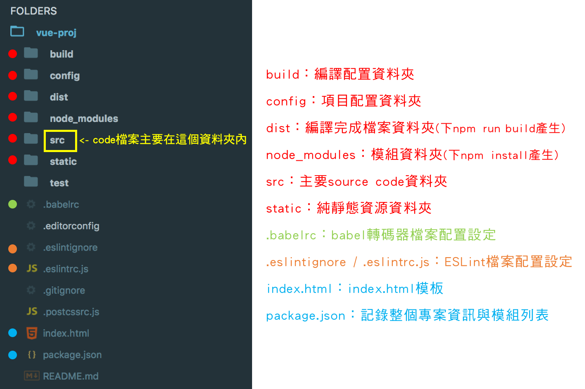
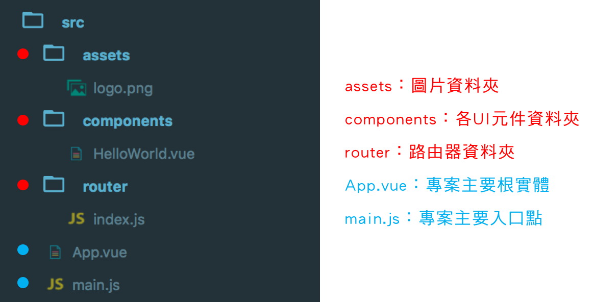

# Day06 - 熟悉Webpack專案架構

## 專案整體架構

當我們使用webpack樣板初始化一個完整的vue專案，該專案資料夾內基本架構如下圖：

###### **static資料夾內存放的是“真正的”靜態資源，他們不會被webpack處理。

#### 認識babel與ESLint

* **babel**是一個轉碼器，因為目前瀏覽器對於新型態JavaScript語法支援度不高，babel-loader可將ES6或ES7語法轉為支援度高的ES5的語法。
* **ESLint**目的是改善程式碼品質，發現與修正程式碼的問題並達到一制性，所以有安裝此套件的話，常常會在編譯執行時看到很多warning訊息，如果安裝之後想要忽略ESLint檢查，可以到.eslintignore文件中做修改。

### src資料夾底下架構

而我們主要編輯的code檔案會放在src這個資料夾內，src資料夾內架構如下圖：

從上圖可以了解到，main.js是整個專案的主要入口點，他會去連接到這個專案主要的根實體App.vue。

有關vue專案的運作流程，會在下一篇詳細介紹。

-----

### 參考資料
* [[Vue.js教學筆記]Webpack模組整合工具架構與路由器配置介紹](http://a091234765.pixnet.net/blog/post/400864892-%5Bvue.js%E6%95%99%E5%AD%B8%E7%AD%86%E8%A8%98%5Dwebpack%E6%A8%A1%E7%B5%84%E6%95%B4%E5%90%88%E5%B7%A5%E5%85%B7%E6%9E%B6%E6%A7%8B%E8%88%87%E8%B7%AF%E7%94%B1)