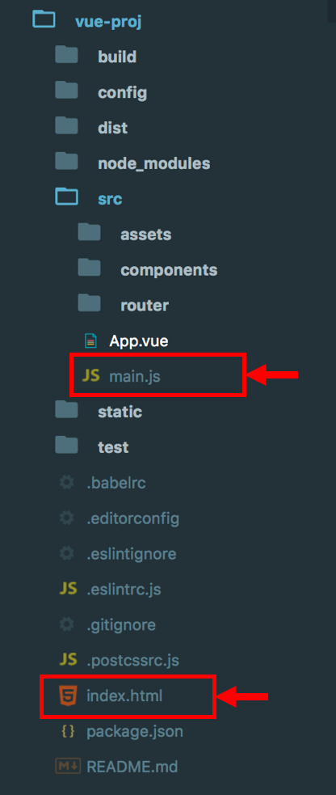
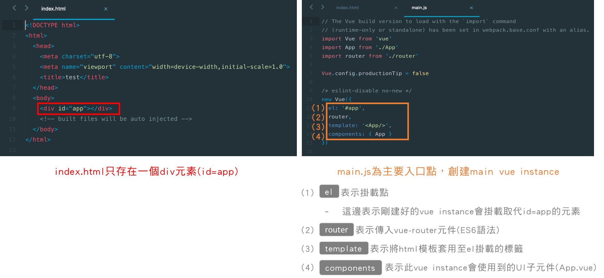
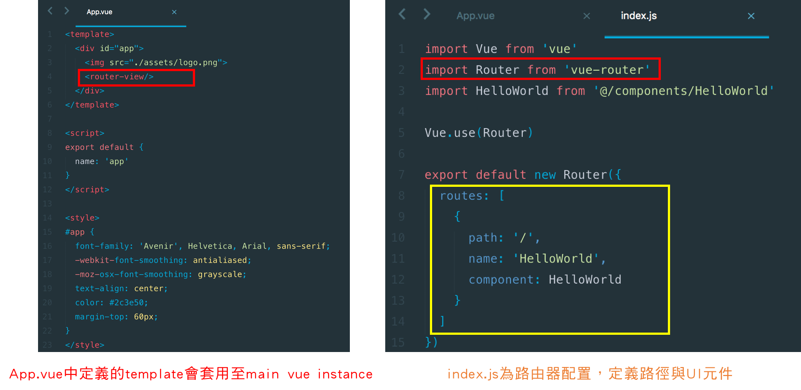
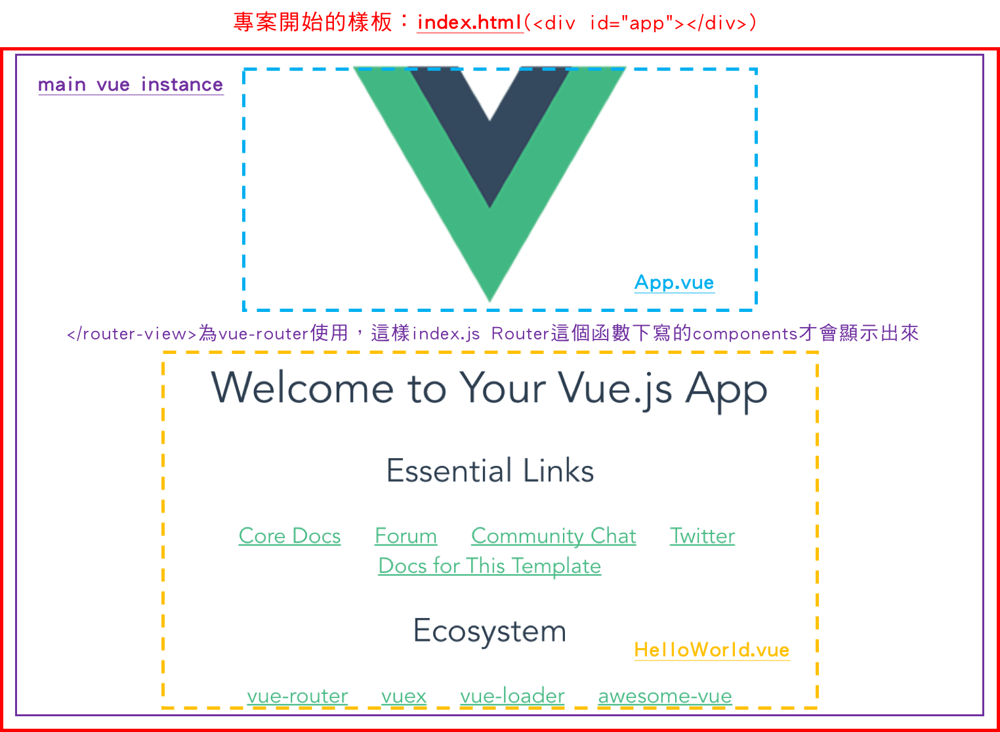
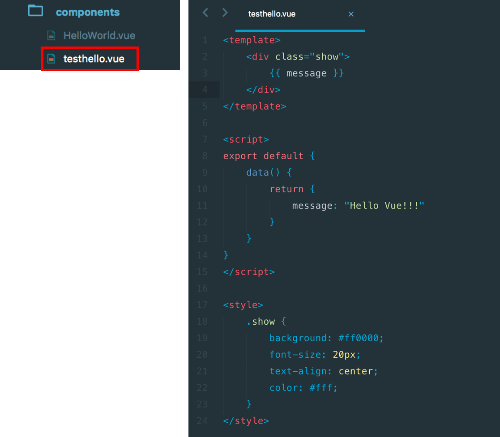
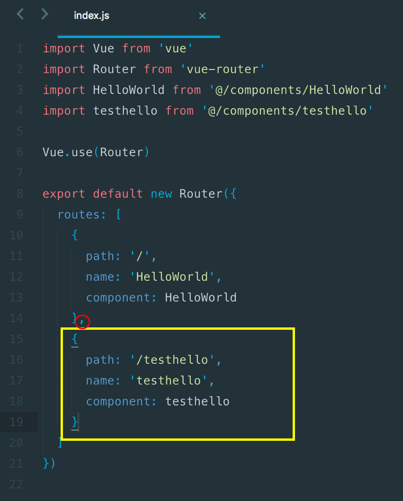
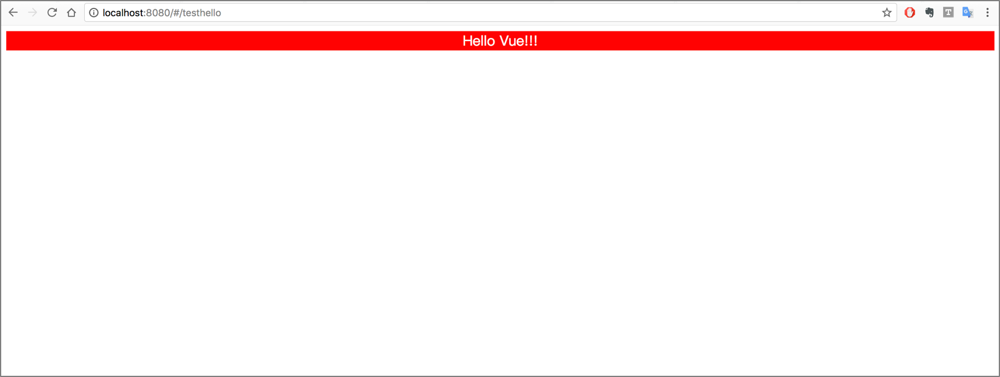

# Day07 - 基本Webpack專案運作流程

在大致了解以webpack樣板建置的專案架構後，我們接下來來了解整個app運作流程。

當我們下**npm run dev**這個指令後，啟動http server，這個指令會同時開啟根目錄下的index.html與src資料夾內的main.js這兩個檔案

而main.js會同時運行App.vue以及在router資料夾內的index.js

`</router-view>`是路由器顯示標籤，為vue-router使用，在index.js下Router函數中所使用的UI元件皆會套用至這個標籤當中。

index.js中，可以在Router這個函數內，自定義url路徑名稱(path)，components下可以放入寫好的UI元件。

因此，如果我們要產生新的UI元件，就要寫一個.vue檔，可放置在components資料夾之下；如果我們要將這個vue元件顯示出來，就需要到index.js中修改路由配置，下面舉例實作看看。

### 實作：新增一個顯示Hello Vue的component

在components資料夾內先新增一個testhello.vue的檔案

然後修改index.js，新增一個新的url路徑與components

最後下指令啟動server後，瀏覽器輸入[http://localhost:8080/#/testhello](http://localhost:8080/#/testhello)，會如下圖所示

###### **通常如果沒按Ctrl+C停止server，網頁會自動更改，不用按F5，只是網址要更動

-----

### 參考資料
* [[Vue] 跟著 Vue 闖蕩前端世界 - 05 基礎 Vue 語法介紹](https://dotblogs.com.tw/wasichris/2017/03/04/013446)
* [[Vue.js教學筆記]Webpack模組整合工具架構與路由器配置介紹](http://a091234765.pixnet.net/blog/post/400864892-[vue.js%E6%95%99%E5%AD%B8%E7%AD%86%E8%A8%98]webpack%E6%A8%A1%E7%B5%84%E6%95%B4%E5%90%88%E5%B7%A5%E5%85%B7%E6%9E%B6%E6%A7%8B%E8%88%87%E8%B7%AF%E7%94%B1)