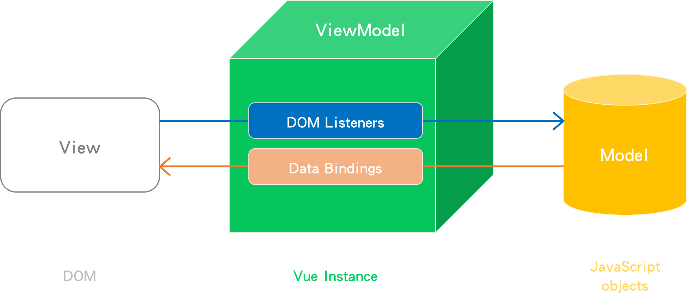

# Day10 - [Directives] 事件處理(Event Handling)

我們看到的網頁，了解使用者對UI元件的操作，不會只有是在表單元素內輸入或選擇內容，還有點擊按鈕或送出表單等等**DOM事件**，而事件的觸發會造成資料的異動，為了得知資料異動的前後差異，並且做出相對應的回應，才能完成一次的事件處理，而且必須即時**監聽**是否有事件被觸發，整個網頁才會有互動性。

所以這篇我們將介紹Vue的**事件處理**(Event Handling)，先來回憶一下前面我們提到Vue的MVVM model：



從上圖可以了解到，Vue可以將**事件監聽**放在HTML元素中，再透過ViewModel將事件處理方法(method)與data綁定在View上，使用者看到的UI就會有剛剛處理好的事件處理結果，如此一來，開發者也可以很容易找到事件監聽器對應的事件處理方法。

那首先，我們先認識一下選項物件(Options)的一個屬性，`methods`(方法)。

## 選項物件屬性：`methods`

`methods`這個屬性用來定義方法，如果我們在UI操作了什麼動作，都可以寫`methods`去回傳方法，執行相對應的事件，通常`methods`定義方法的方式是一個包住`function`的`object`。下面我們寫一個方法可以用來計數，範例如下：

```html
<div id="app">
    <p>{{ count }}</p>
</div>
```

```javascript
var vm = new Vue({
    el: '#app',
    data: {
        count: 0
    },
    methods: {
        addCount: function() {
            this.count += 1;
        }
    }
});
```

為了增加使用者操作頁面的互動性，所以當方法寫好後，就需要有個地方去呼叫(觸發)這個方法，此時我們可以在HTML元素中加入事件監聽器，使用的指令就是`v-on`。

## 事件處理指令

### `v-on`

* 用途：在HTML元素中加入事件監聽器，即可找到對應的事件處理方法，也就是我們在vue instance宣告的methods。
* 縮寫：`@`
* 表達式：`function`、`inline statement`、`object`
* 用法：

現在我們來呼叫剛剛那個計數的方法，使用一個按鈕讓他可以執行方法並傳回結果。

#### 1. 方法`function` 寫法：

```html
<div id="app">
    <!-- 上下兩者結果一樣，下面為縮寫寫法 -->
    <button v-on:click="addCount()">點我+1</button>
    <button @click="addCount()">點我+1</button>
    <p>{{ count }}</p>
</div>
```

```javascript
var vm = new Vue({
    el: '#app',
    data: {
        count: 0
    },
    methods: {
        addCount: function() {
            this.count += 1;
        }
    }
});
```

* [run on JSFiddle](https://jsfiddle.net/eva19950630/0LLq3kb8/)

#### 2. 行內敘述`inline statement` 寫法：

使用縮寫語法。

```html
<div id="app">
    <button @click="count += 1">點我+1</button>
    <p>{{ count }}</p>
</div>
```

```javascript
var vm = new Vue({
    el: '#app',
    data: {
        count: 0
    }
});
```

* [run on JSFiddle](https://jsfiddle.net/eva19950630/mxdoh8to/)

`click`點擊的事件監聽是可以蠻常用的DOM Event，但除了`click`點擊的事件監聽以外，還可以參照[HTML DOM Events](https://www.w3schools.com/jsref/dom_obj_event.asp)，其他像是`mousedown`、`mouseover`等等也可以使用。

### 修飾符號 Modifiers

Vue在事件行為與滑鼠、鍵盤監聽的處理上也有提供**修飾符號**，讓我們可以在做事件處理時更加方便操作。

#### * 事件行為

修飾符號 | 用途
------------- | ------------- 
`.stop` | 呼叫js中的`event.stopPropagation()`，停止事件繼續傳遞。
`.prevent` | 呼叫js中的`event.preventDefault()`，防止執行瀏覽器事件的預設行為。
`.capture` | js的事件傳遞可分為向下捕獲(event capturing)與向上冒泡(event bubbling)，加入此修飾符號時，事件傳遞方向即為向下捕獲(event capturing)模式。
`.self` | 只會在有寫事件監聽器的HTML元素本身觸發(不含子元素)時才會觸發方法。
`.native` | 監聽元件根元素的原生事件。
`.once` | 事件只能被呼叫一次。
`.passive` | 2.3.0版本後加入，會以`{ passive : true }`的模式添加事件監聽器。

舉幾個常用的修飾符，範例如下：

先有一個概念，js預設的事件傳遞方向為**向上冒泡(event bubbling)**，
也就是**從內到外**執行：thirdFunction() -> secondFunction() -> firstFunction()

```html
<div @click="firstFunction()">
    <div @click="secondFunction()">
        <button @click="thirdFunction()">點我</button>
    </div>
</div>
```

接著，我們來測試這些修飾符的功能。

```html
<div id="app">
    <!-- No modifiers -->
    <div @click="firstFunction()">
        <div @click="secondFunction()">
            <p>
                沒有修飾符：
                <button @click="thirdFunction()">點我</button>
            </p>
        </div>
    </div>
    
    <!-- Add .stop modifiers -->
    <div @click="firstFunction()">
        <div @click="secondFunction()">
            <p>
                加入.stop修飾符：
                <button @click.stop="thirdFunction()">點我</button>
            </p>
        </div>
    </div>
    
    <!-- Add .prevent modifiers -->
    <div>
        <form method="POST">
            <span>瀏覽器預設行為會跳轉頁面：</span>
            <input type="text" placeholder="input something">
            <button>Submit</button>
        </form>
        <form method="POST">
            <span>加入.prevent修飾符：</span>
            <input type="text" placeholder="input something">
            <button @click.prevent>Submit</button>
        </form>
    </div>
    
    <!-- Add .capture modifiers -->
    <div @click.capture="firstFunction()">
        <div @click.capture="secondFunction()">
            <p>
                加入.capture修飾符：
                <button @click.capture="thirdFunction()">點我</button>
            </p>
        </div>
    </div>
    
    <!-- Add .self modifiers -->
    <div class="outerDiv" @click.self="firstFunction()">
        <div class="middleDiv" @click.self="secondFunction()">
            <p>
                加入.self修飾符：
                <button @click="thirdFunction()">點我</button>
            </p>
        </div>
    </div>
    
    <!-- Add .once modifiers -->
    <div>
        <p>
            正常執行計數function：
            <button @click="addCount1()">點我+1</button>&emsp;{{ count1 }}
            &emsp;
            加入.once修飾符：
            <button @click.once="addCount2()">點我+1</button>&emsp;{{ count2 }}
        </p>
    </div>
</div>
```

```javascript
var vm = new Vue({
    el: '#app',
    data: {
         count1: 0,
         count2: 0
    },
    methods: {
        thirdFunction () {
            alert('thirdFunction() is called.');
        },
        secondFunction () {
            alert('secondFunction() is called.');
        },
        firstFunction () {
            alert('firstFunction() is called.');
        },
        addCount1 () {
            this.count1 += 1;
        },
        addCount2 () {
            this.count2 += 1;
        }
    }
});
```

* [run on JSFiddle](https://jsfiddle.net/eva19950630/328q1aj8/)

上面的範例執行結果應該如下：

* 沒有修飾符的執行結果會是**bubbling**方向，thirdFunction() -> secondFunction() -> firstFunction()。
* `.stop`修飾符會只有call `thirdFunction()` 一次，`secondFunction()`和`firstFunction`不會被執行。
* `.prevent`修飾符讓submit不會跳轉頁面。
* `.capture`修飾符的執行結果會是**capturing**方向，firstFunction() -> secondFunction() -> thirdFunction()。
* `.self`修飾符，只能在作用區範圍內才能呼叫function。
* `.once`修飾符會讓function只執行一次。

#### * 滑鼠與鍵盤監聽

修飾符號 | 用途
------------- | -------------
`.left` | 只點擊滑鼠左鍵才會觸發事件。
`.right` | 只點擊滑鼠右鍵才會觸發事件。
`.middle` | 只點擊滑鼠中鍵才會觸發事件。
`.{keyCode | keyAlias}` | 只按下鍵盤任一鍵值才會觸發事件。`.keyCode`是指鍵盤代碼、`.keyAlias`是指鍵盤別名。

###### **[鍵盤代碼對照表](http://web.tnu.edu.tw/me/study/moodle/tutor/vb6/tutor/r03/index.htm)

範例如下：

```html
<div id="app">
    <p>
        按滑鼠左鍵才有反應：
        <button @click.left="testFunction()">點我</button>
    </p>
    <p>
        按滑鼠右鍵才有反應：
        <button @click.right="testFunction()">點我</button>
    </p>
    <p>
        <!-- run的時候要去點一下按鈕 -->
        別名 - 按鍵盤space才有反應：
        <button @keyup.space="testFunction()">點我</button>
    </p>
    <p>
        <!-- run的時候要去點一下按鈕 -->
        代碼 - 按鍵盤enter才有反應：
        <button @keyup.13="testFunction()">點我</button>
    </p>
</div>
```

```javascript
var vm = new Vue({
    el: '#app',
    methods: {
        testFunction () {
            alert('Hello!');
        }
    }
});
```

* [run on JSFiddle](https://jsfiddle.net/eva19950630/zjo7zwyt/)

## 事件處理器的刪除

可以手動刪除，但如果一個ViewModel被銷毀時，事件也會跟著自動被銷毀。

最後做個文章總結，上面提到整個事件的產生到銷毀，我們可以在寫好method後，然後透過`v-on`去綁定元素的事件監聽器，完成整個事件處理。

-----

### 參考資料
* [Vue.js - v-on](https://cn.vuejs.org/v2/api/#v-on)
* [Vue.js - Event Handling](https://vuejs.org/v2/guide/events.html)
* [w3school](https://www.w3schools.com/)
* [Vue.js: Methods 與事件處理 (Event Handling)](https://cythilya.github.io/2017/04/17/vue-methods-and-event-handling/)
* [Vue.js (4) - 事件處理指令](http://blog.tonycube.com/2017/04/vuejs-4-event.html)
* [Vue.js 11 - DOM事件處理](https://ithelp.ithome.com.tw/articles/10187655)