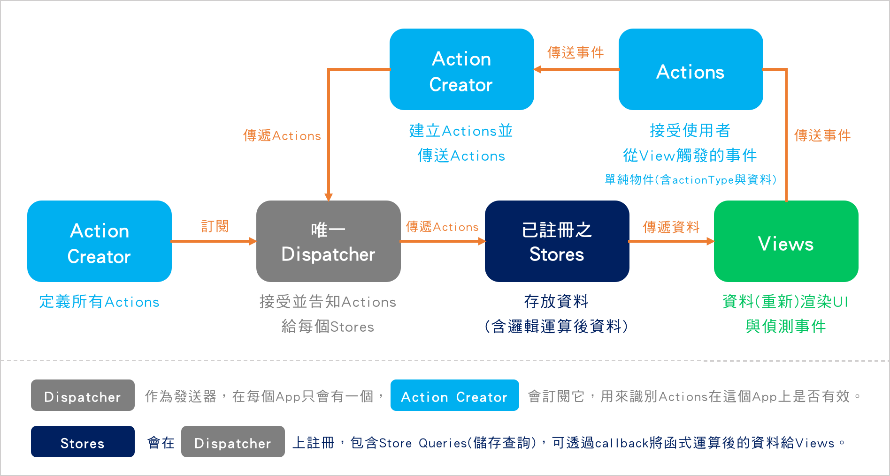
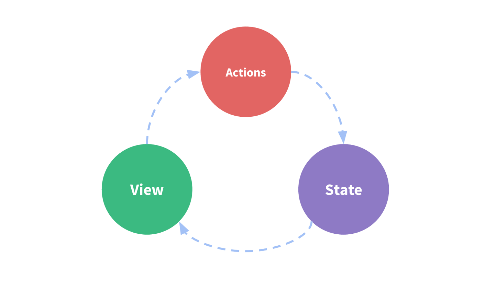
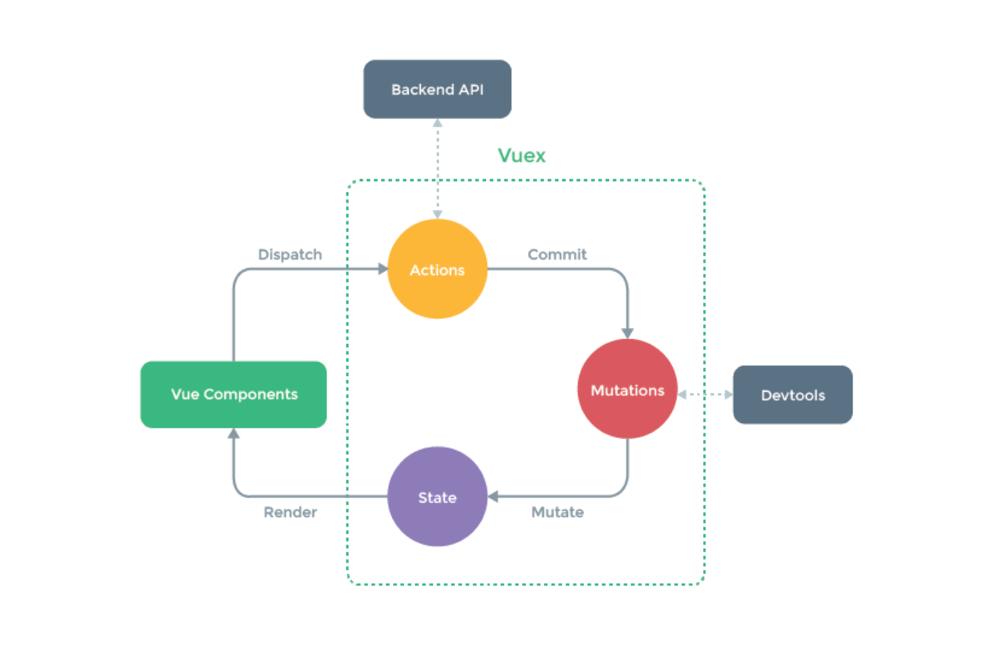
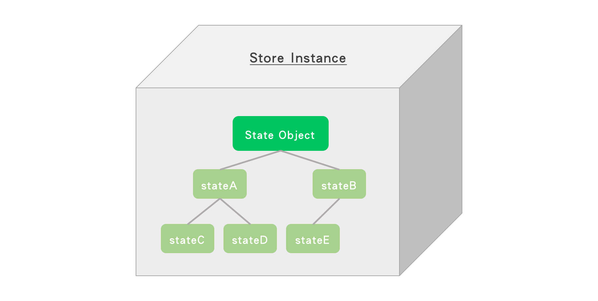

# Day20 - [Components] 狀態管理 - Vuex

前面分別介紹完Vue的directives、options跟components後，從這天開始，我們開始要將我們備好的材料開始煮出一道道好菜了，

前面我們有提到，Vue是一個元件化為主的開發框架，所以各個元件會獨自運作，每個View去接收不一樣的元件，data也會寫在各自的元件當中去使用，但是當開發大型的系統時，可能這個頁面會去用到其他頁面的資料，不斷傳遞重複性的資料可能會造成效能變不好的狀況，所以是不是有一個規劃好的資料傳遞模式可以應用在解決這樣的問題上，下面我們要介紹一個在Vue.js中的**狀態管理模式**：**Vuex**。

## 什麼是Vuex？

> Vuex = Vue + Flux

Vuex為官方推薦的**第三方套件**。

### 先了解一下什麼是Flux？

Flux是一種**單向資料流**的設計模式架構，應用在React進行規模化的時候。那為什麼會有Flux架構的產生？

主要是因為React是一個MVC架構中View的函式庫，每個App都需要有`app state`，當使用者在View觸發事件，而系統監聽到事件後要改變狀態，狀態更動後會再去重新渲染UI，舉例像是使用者登入的狀態，它會是一個幾乎每個頁面都需要知道的狀態，因此為了解決這樣的問題，Facebook就提出了Flux這樣的設計概念，讓資料與事件能在不同頁面之間傳遞。

### 簡單介紹Flux架構


從上圖來看，可以看到傳遞資料的方向是單一方向的，那整個資料流是怎麼運作的？用下圖來做解釋：



Flux會幫助我們在前端開發流程上更有架構更有條理，以下是Flux的優點：

* 明確規範每個角色該做什麼事情，讓開發者快速掌握整個App運作流程。
* 改善data與view的狀態，讓頁面狀態是可以預測的。
* 資料與邏輯狀態統一存放`Store`，讓`View`可以專注在顯示資料。

## 回到Vuex

前面提到Vuex是專門為Vue.js開發App專用的**狀態管理模式**，採用集中式儲存管理所有components的狀態，確保狀態一旦更動即會發生變化(頁面重新渲染等動作)，所以也可以把Vuex當作是Vue的**狀態管理庫**。

我們來回憶一下前面學過的一些Vue的屬性應用，來創建一個包含事件的component。

範例：這是一個counter

```html
<div id="app">
    <counter></counter>
</div>
```

```javascript
Vue.component ('counter', {
    template: `<div>
                <button @click="addCount()">CLICK</button>
                <p>{{ count }}</p>
               </div>`,
    data: function() {
        return {
            count: 0
        }
    },
    methods: {
        addCount: function () {
            this.count++
        }
    }
})

new Vue ({
    el: '#app'
})
```

* [run on JSFiddle](https://jsfiddle.net/eva19950630/bqnm65t1/)

上面我們應用到`template`、`data`、`methods`的options屬性，如此就能做出一個簡單的事件處理，而Vue簡單的狀態管理模式就如下圖所示，呈現一個單向資料流的流向：



* `State`：從狀態的變化回傳對應的資料給View去呈現。
* `View`：將資料狀態呈現在使用者使用的UI上。
* `Actions`：偵測使用者在View上觸發的行為並給予相對應的狀態變化。

不過這是簡單一個元件的操作，當我們想要多個元件一起**共享狀態**時(例如：使用者登入狀態)，下面兩種情形可能是我們會碰到的問題：

* 多個Views仰賴同一個State。
* 來自不同Views的行為變更同一個State。

因此，為了解決以上可能會碰到的問題，我們把元件的共享狀態全部抽出來然後全局管理，**Vuex**這套狀態管理的架構就產生了，它參考React現下常用的**Redux**狀態管理模式(Redux也是基於Flux架構延伸出來的一種設計模式)，一樣是單向資料流模式，是一套專門為Vue.js所設計的狀態管理庫，提高整體運作的狀態更新效能。



先理解一個概念，Vuex跟Flux有一點點不太一樣，Flux的架構包含View的重新渲染，但是Vuex處理的範圍只有上圖綠色虛線的這整塊，通過Vuex的狀態處理後，才會讓Vue去渲染元件進而產生畫面，這邊要先注意一下不要搞混了。

Vuex使用**單一狀態樹**(像是下圖的感覺)，它最核心的概念就是把狀態(`State`)儲存至`Store`實體，`Store`就像是一個倉庫，儲存著整個App所有的狀態。



那接下來我們就介紹在Vuex這個綠色框框中，每個角色分別所做的事情：

* `Actions`：
   1. 定義整個App的所有行為，使用者在前端元件觸發的事件會`dispatch`給`Actions`，接著`Actions`會去`commit mutation`，進而讓相對應的`mutation handler`去做更改狀態的動作。
   2. 在這個階段因為常要從後端讀取資料，所以也可以進行**非同步地**跟Backend API溝通。
* `Mutations`：
   1. 透過`commit`接收`Actions`傳遞的資料與行為，並經過計算處理過後改變`State`。
   2. 每個`Mutation`都有一個字串型態的`事件類型(type)`和一個`回調函數(handler)`。
   3. `回調函數(handler)`就是我們**實際**更改狀態的地方，第一個參數即帶入`State`。
   4. 注意只有使用`commit mutation`才能改變在`Store`中的狀態，這個動作就像是**註冊事件**一樣，是不可以直接調用`mutation handler`的。
* `State`：
   1. 用一個物件型態記錄整個App的所有狀態。
   2. 讓`Mutation`去更改狀態。
   3. 雖然建議是將App的所有狀態全部放入`Store`，但是Vuex還是保有彈性，可以讓元件保有自己的局部狀態。

#### `Actions`跟`Mutations`有點相似，跟事件處理都相關，但是它們兩者還是有不一樣的地方：

比較 | `Actions` | `Mutations`
------------- | ------------- | -------------
更改狀態 | `Actions`只能透過`commit mutation`去提交事件，不能直接更改狀態。 | `Mutations`透過`mutation handler`直接實際更改狀態。
處理的事件種類 | 可同時處理**非同步**事件(call API)，這樣就可以在此階段等待API回應的時間，接收到的資料再`commit`給`Mutations`，`Mutations`收到的資料就會是即時的。 | 只能處理**同步**事件。

大致了解各個角色的定位後，我們就用一段話來整理一下它的運作流程：

> 當Vue.js的App使用了Vuex狀態管理庫後，整個App的幾乎所有states都會儲存至`Store`物件之中，`Actions`會定義好App的所有行為，當使用者在前端View觸發事件後，Vue會去`dispatch`發送行為給`Actions`，`Actions`接收到行為後會去`commit mutation`，`Mutations`接收到`Actions`傳遞的行為後，會去找對應的`mutation handler`並進行邏輯運算處理，直接實際更改`State`物件下的某個state，當state一被更動，Vue就會收到狀態更動的訊息，即會重新`render`渲染View。

## Vuex適用的時機

前面我們大致介紹完Vuex的概念了，最後我們來總結一下Vuex適用的時機吧！

**中大型**網頁App開發時，如此一來就可以把狀態統一管理，開發上也可以比較方便與提高效率，而小型的較不建議，因為使用起來反而更加繁雜。

接下來幾篇我們將介紹如何安裝Vuex，並且做Vuex的實際應用。

-----

### 參考資料
* [Vuex - Introduction](https://vuex.vuejs.org/zh-cn/)
* [Flux官網](https://facebook.github.io/flux/docs/overview.html)
* [Flux - 為React打造的單向資料流架構](http://eddychang.me/blog/javascript/94-flux-concept.html)
* [vue & vuex 10 - 什麼是 vuex?](https://ithelp.ithome.com.tw/articles/10185686)
* [【Day17】 從哪來到哪去 - Data Flow](https://ithelp.ithome.com.tw/articles/10196024)