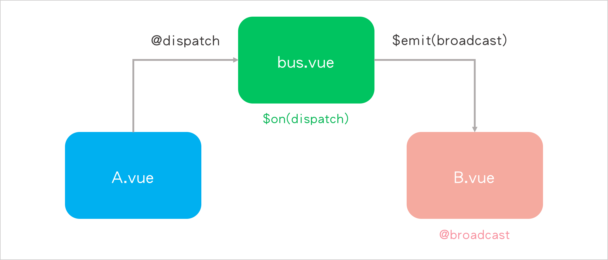

# Day21 - [Vuex實作-購物車(1)] Vuex環境安裝與建立新專案

前一篇我們提到Vuex是將所有元件的**「狀態」**全部集中儲存管理，那麼這個**「狀態」**指的到底是什麼呢？

這個「狀態」會區分成對元件的**「元件局部狀態」**(Component Local State)還是**「應用層級狀態」**(Application Level State)，而Vuex就是將所有**「應用層級狀態」**全部匯集到一個倉庫(`Store`)管理，所謂的狀態可以舉例像是我們在Vue Instance裡放入的`data`屬性，裡面的資料一有變動，即狀態就會有所變動。

## 怎樣的情境我們需要用到Vuex？

假設我們有一個Vue Instance(`bus.vue`)，作為父元件，而它之下還有兩個子元件(`A.vue`與`B.vue`)，前面我們學過，父子元件可透過`props up, events down`的方式來做溝通，但是，如果是`A.vue`與`B.vue`這兩個子元件之間的溝通呢？

還記得我們前面提到的**非父子元件的溝通**嗎？我們知道元件是獨立運作的，作用範圍不會互相影響，所以是不能直接`A.vue`→`B.vue`做溝通的，它們需要借助父元件`bus.vue`的幫忙，透過事件來傳遞訊息：

* `A.vue`丟(`v-on`)一個事件`dispatch`給`bus.vue`。
* `bus.vue`監聽(`$on`)`A.vue`的`dispatch`事件，並同時發送(`$emit`)一個`broadcast`事件給`B.vue`。
* `B.vue`需綁定(`v-on`)`bus.vue`的`broadcast`事件。

上面的過程就如下圖所示：



這樣的過程只是兩個子元件之間的溝通而已，一個父元件底下不可能只有兩個子元件，很多個子元件如果要互相溝通，都要透過上面這樣的方式，那會導致父元件需要監聽很多事件，而子元件需要綁定父元件的事件，父元件又需要非常清楚知道要丟給這個子元件什麼事件，如此一來，這溝通路徑會非常繁瑣又複雜，所以Vuex就是使用在解決這樣的情境下而產生的，專門為Vue.js設計的狀態管理模式。

上面複習這麼多Vuex的概念，其實是因為我看到一篇解釋還不錯的文章，想說記錄下來，這樣對Vuex會更加熟悉，下面我們來進行安裝實作Vuex。

## Vuex環境安裝

可以使用下列兩種方法來安裝Vuex環境：

### 1. 使用npm安裝Vuex套件(推薦使用)

> 記得將路徑切換到專案目錄底下再安裝喔！

```
$ npm install vuex --save
```

### 2. 直接下載js檔或則引用CDN檔

> [https://unpkg.com/vuex](https://unpkg.com/vuex)

這個網址會一直指向npm上面發布最新版本的Vuex，如果要更改版本只需要更改url中的`vuex@[版本]`。

使用方法直接在`vue`之後引入`vuex`：

```html
<script src="/path/to/vue.js"></script>
<script src="/path/to/vuex.js"></script>
```

## Vuex實作專案 - 購物車

從這一天到Day23我會連做3天的Vuex實作，因為Vuex較適合中大型網站的應用，放眼望去現在比較多中大型網站就屬電商平台最多了，所以我打算將Vuex應用到實作一個購物車平台，以下是我想完成的功能：

* 商品頁面：包含商品名稱、圖片、單價、規格、欲購買數量、剩餘商品數量、加入購物車按鈕、詳情
   * 商品圖片依據規格不同會切換不同圖片
   * 商品價格依據規格不同會顯示不同價格
* 購物車頁面：包含放入的商品(顯示選擇的商品名稱、規格、單價、數量、總計)、從購物車移除商品按鈕、選購商品的總數量與總價格
* 兩個頁面共用一個navbar，左邊放logo、右邊放一個購物車icon
   * 購物車icon會統計目前在購物車當中選購商品的總數量

介面排版大致如下圖：


### 開始建立新專案

複習使用`vue-cli`模組建立專案：

```
$ vue init webpack shopping-cart
$ cd shopping-cart

#通常創建專案的時候就會問你要不要一起執行"npm install"了，確保萬一還是下指令看看有沒有安裝好
$ npm install
```

這天就先到這邊，預計Day22寫**商品頁面**，Day23寫**購物車頁面**，重要的是帶入Vuex的應用。

-----

### 參考資料
* [Vuex - 安装](https://vuex.vuejs.org/zh-cn/installation.html)
* [使用Vue.js和Vuex实现购物车场景](http://xlbd.me/vue-vuex-shopping-cart/)