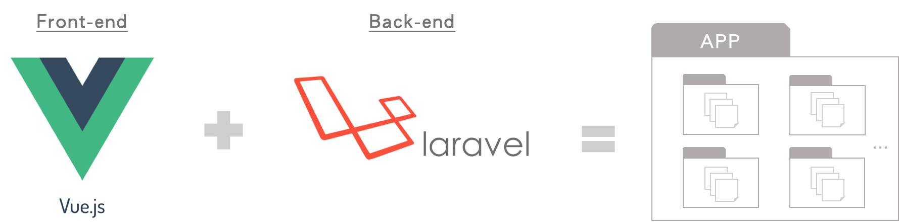
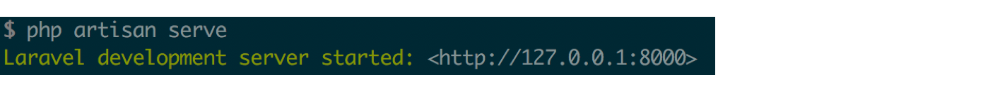
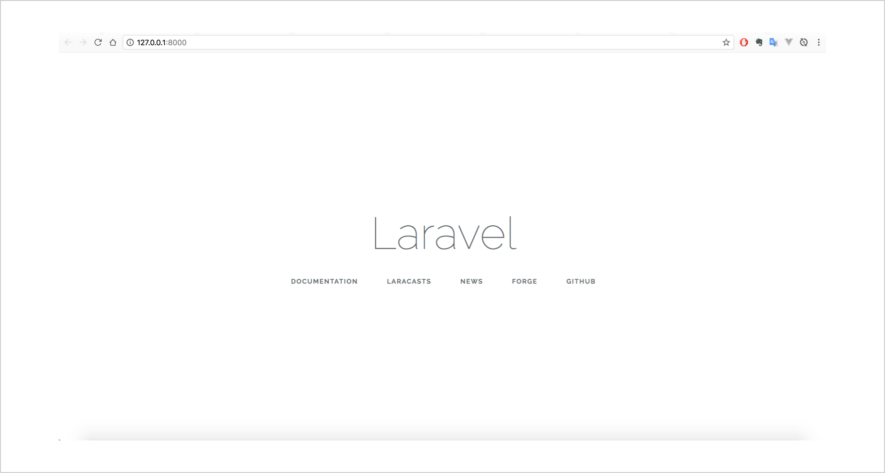

# Day24 - [Vue + Laravel] 認識Laravel與環境建置

在現代網站大量開發的時代下，Framework(網頁開發框架)的勢力愈來愈強，為什麼有使用Framework的架站技術會如此受歡迎呢？主要原因是因為Framework擁有比較明確的**MVC架構**，而且**檔案架構統一**，什麼目錄下寫入什麼檔案都有規範好，在除錯或是維護上可以大大提高效率，尤其大部分的Framework都會有開發好的套件可以直接去做安裝，安裝完後就會產生一個完整的專案資料夾，不必像以前一樣從0刻起，讓架站的速度可以更快、更容易上手。

Vue.js是一個前端的框架技術，開發網站不只有前端，後端的資料庫與伺服器也是很重要的，那我們要如何將Vue搭配後端整合成一個App專案？

我們可以使用看看**Laravel**，因為Laravel在版本5.3之後，直接引入Vue成為**預設前端框架**，於是我們今天將來試試看使用Laravel這個Framework，並在Laravel的專案中加入Vue檔案，完成一個前後端架構都有的App專案，那首先我們先來認識一下**Laravel**。

## 認識Laravel


**Laravel**是一個開發php網站的Framework，一樣是基於MVC架構建置而成，在傳統php網頁開發時，我們通常會將所有邏輯(包含程式邏輯、讀取資料庫或則是前端的顯示)全部寫在一個`.php`檔裡面，將HTML與php語法夾雜在一起，甚至JS也會寫在裡面，每個`.php`檔都看起來很亂，而且我們為了好維護，會取名一些自己比較好理解的檔名，如此一來，會造成網站被有心的人攻擊也不是不一定。所以**Laravel**的出現解決了開發php網站這樣的困擾，它強調是一個**全功能**開發框架，能做的事情很多，而且沒有太繁瑣的設定，所以也很容易上手，它底下的有很多的工具，會讓我們在開發網頁上更有效率。

## Laravel環境建置與建立專案



### 1. 安裝php與composer

composer是php的依賴性套件管理工具，首先要先安裝php才能執行安裝composer。

#### ＊以下安裝方法適用Mac系統：

先安裝`homebrew`(`homebrew`跟`npm`很像都是套件安裝工具)

> 注意要先安裝Xcode APP。

```
#如果已經有homebrew了，直接更新homebrew
$ brew update

#如果沒有homebrew，輸入下列指令安裝homebrew
$ /usr/bin/ruby -e "$(curl -fsSL https://raw.githubusercontent.com/Homebrew/install/master/install)"
```

使用brew安裝`php`與`composer`

> 注意Composer需要php版本5.3.2以上才能使用。

```
#可以先檢查電腦裡面有沒有php
$ php -v

#如果沒有，輸入下列指令安裝php，這邊先安裝版本7.0，也可以自己挑版本
$ brew tap homebrew/dupes
$ brew tap homebrew/php
$ brew install php70

#安裝composer
$ brew install composer

#檢查composer是否安裝成功，若出現-bash: composer: command not found，代表安裝失敗
$ composer -v
```

#### ＊Windows系統安裝php與composer建議到官網直接載套件會比較好：

* [php for windows](http://windows.php.net/download/)
* [composer](https://getcomposer.org/)

### 2. 使用composer指令來建立Laravel專案

> [Project_name]為App名稱

```
$ composer create-project --prefer-dist laravel/laravel [Project_name]
```

### 3. 啟動Laravel內建伺服器

```
$ cd [Project_name]
$ php artisan serve
```

輸入完上面的指令，應該會看到終端機顯示以下畫面：



再打開瀏覽器，輸入[http://127.0.0.1:8000](http://127.0.0.1:8000)，會看到以下起始畫面即代表**專案建立成功**：



到這個步驟就完成了Laravel的環境建置與建立專案，接下來我們將稍微了解一下Laravel的專案是怎麼運作的，然後放入Vue的檔案，這樣就能整合成一個**Vue + Laravel的App**了。

-----

### 參考資料
* [Laravel官網](https://laravel.com/)
* [給 Laravel 初學者的幾點建議](http://oomusou.io/laravel/laravel-for-newbie/)
* [Vue.js (11) - 在 Laravel 5.4 中使用 Vue 2.1](http://blog.tonycube.com/2017/06/vuejs11-laravel-vue.html)
* [Vue.js 28 - 搭配後端 - Laravel(環境建置)](https://ithelp.ithome.com.tw/articles/10188885)