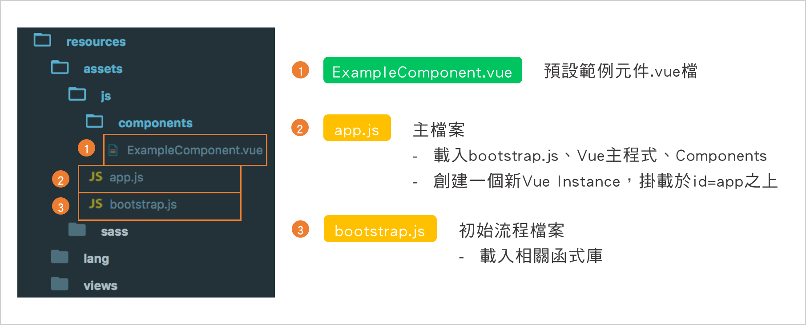
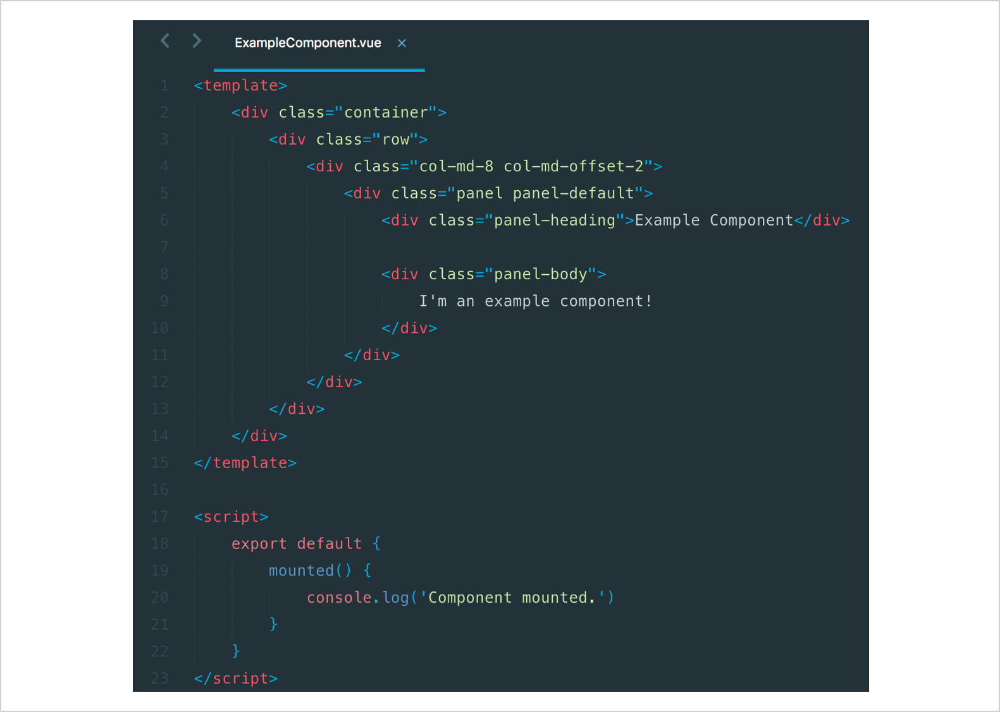
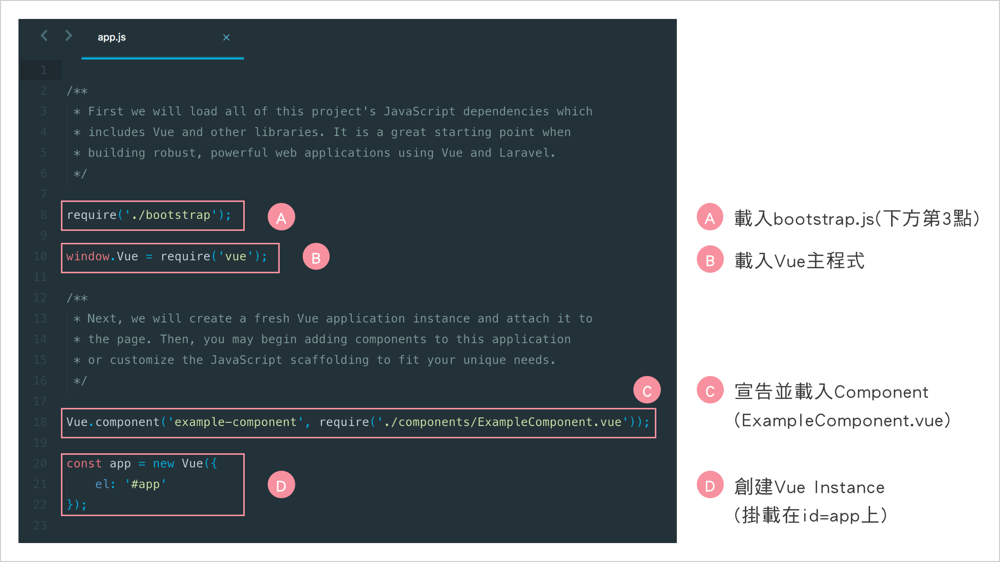
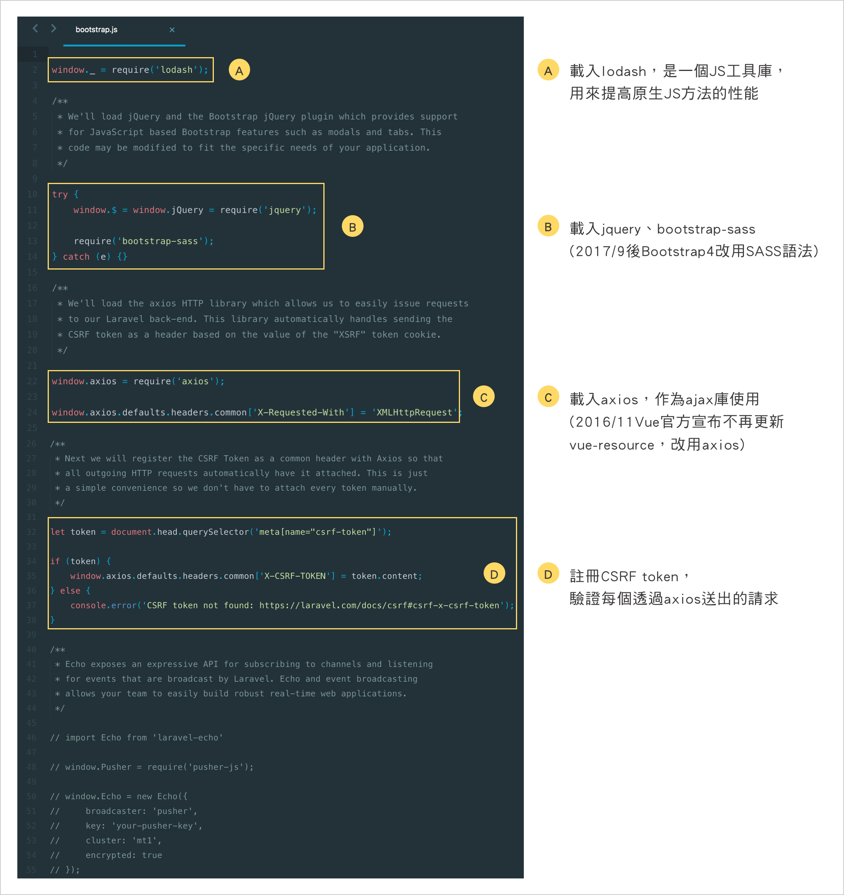
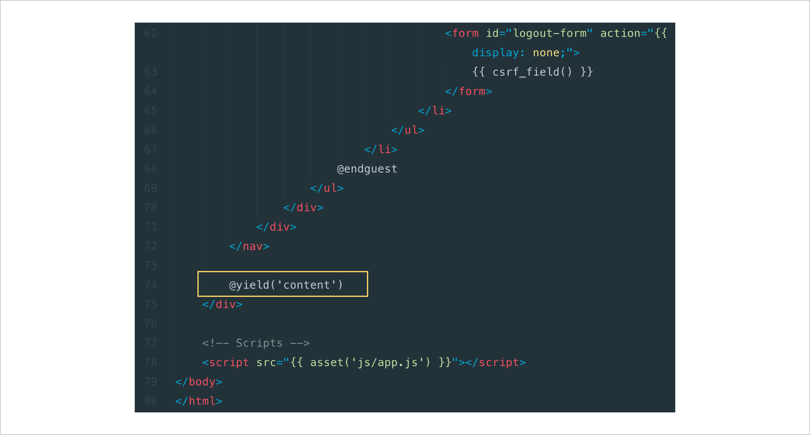
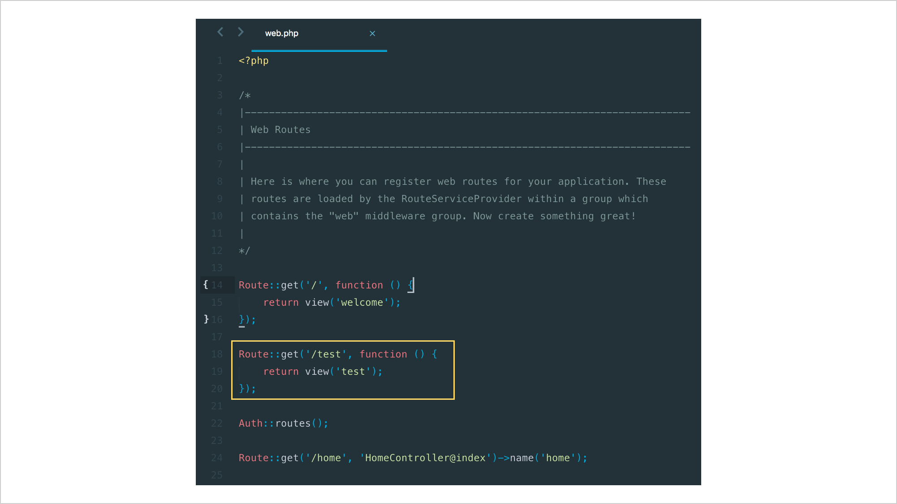
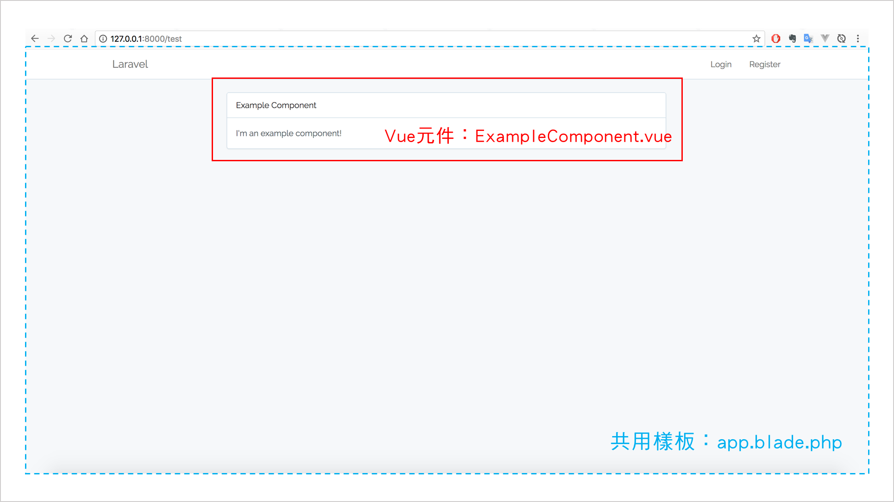

# Day26 - [Vue + Laravel] Laravel Artisan & 編譯與顯示Vue元件

這篇我們要開始將自己建立Vue的樣板並放入Laravel的專案當中，讓它去編譯樣板並顯示出來。

## Laravel Artisan

首先我們先認識Laravel的專用指令工具，**Artisan**如何使用。

### 使用Artisan的方式為

```
$ php artisan [參數]
```

### 常用Artisan指令

指令 | 用途
---------- | ----------
`$ php artisan` or `$ php artisan list` | 查看後面可接什麼`[參數]`選項
`$ php artisan serve` | 啟動Laravel內建伺服器
`$ php artisan route:list` | 查看應用程式所有已註冊過的路由(route)清單
`$ php artisan migrate` | 執行資料庫遷移檔(migrations)
`$ php artisan make:migration` | 建立一個新的資料庫遷移檔
`$ php artisan migrate:status` | 查看每個資料庫遷移檔的狀態
`$ php artisan migrate:rollback` | 返回上一次資料庫遷移的動作
`$ php artisan db:seed` | 使用種子(seed)建立資料庫資料
`$ php artisan make:auth` | 快速建立註冊與登入的views、routes、controller
`$ php artisan make:controller` | 建立一個新的controller類別
`$ php artisan make:event` | 建立一個新事件
`$ php artisan make:job` | 建立一個新任務
`$ php artisan clear-compiled` | 清除已編譯的類別檔
`$ php artisan cache:clear` | 清除應用程式快取

## 顯示預設Vue樣板：ExampleComponent.vue

接著我們要來試試看在Laravel專案下，顯示Vue的元件。

上一篇我們提到在Laravel專案架構底下，Vue元件通常會放在`resources/assets/js/components`目錄下，而要顯示的View寫在`resources/views`之下。也就是說，如果我們要在Laravel專案下使用vue元件，那就要在根目錄下的`resources`目錄下實作。

> 註：Laravel的預設樣板是使用Blade。

我們今天要來好好探討一下Vue元件要怎麼讓它被編譯以及了解在此目錄以外，一些檔案的用途。



#### 1. `ExampleComponent.vue`

這是一個預設名為`ExampleComponent`的元件檔，等等我們就來做一些設定，看是否能順利顯示出此元件檔的內容。



#### 2. `app.js`

它是進入Vue元件的主要js檔，這邊會匯入Vue的主程式檔與創建Vue Instance。



#### 3. `bootstrap.js`

這個檔案會載入需要的函式庫與註冊CSRF Token，會在`app.js`一開始給載入。



### 設定一下讓Laravel顯示Vue元件

#### 1. 透過指令快速建立註冊與登入的views、routes、controller

> 前面我測試的時候，我試過直接顯示Vue的component，不過好像怎麼樣都無法顯示出來，後來執行`php artisan make:auth`讓它快速產生註冊與登入的views及在頁面上共用的部分(像是navbar)，然後創建一個新的view(有繼承它共用部分)，將component放入就可以顯示出來了，所以我猜測可能是因為Laravel是吃blade樣板的關係，Vue元件無法直接被編譯，需要透過**間接繼承**的方式才能吃到元件的畫面。(這段純屬我的理解部分，可能會理解錯誤，如果有專家知道答案可以替我解惑一下，感激不盡～)

在終端機執行`php artisan make:auth`後會在`resources/views`底下產生一些新的blade樣板。

```
$ php artisan make:auth
```

#### 2. 在`resources/views`下新增一個新blade樣板：`test.blade.php`

新增完檔案後，整個`resources/views`目錄會如下圖所示：


上面用紅色框框框起來的檔案即是我們等等要操作的檔案。

#### 3. 先看一下`app.blade.php`

這全部就是在寫navbar、背景與一些CSRF驗證的東西，重要的是下圖這行：



這行就是用來設定一個section名叫`content`，等等我們就可以將Vue元件放入此`content`內。

> 其實有開發網站的經驗後，就會了解其實這樣將頁面**共用的部分**寫在同一個view中才是比較好的做法，因為這樣我們只要在該頁面想顯示的畫面用比較節省的寫法去寫好，然後再套用進像是上方範例的`content`，加上我們現在可以把Vue元件放入，Vue元件可以將HTML、JS、CSS一起寫入，如此一來在開發Laravel上真的方面許多。

#### 4. 編輯`test.blade.php`內容

加入以下內容，其實不難理解，放入Vue元件的方式就跟我們之前學的一樣。

> `<example-component>`是前面我們在`resources/assets/js`的`app.js`下宣告的component。

```php
// 繼承在layouts目錄下的app.blade.php
@extends('layouts.app')

// 在content section放入example-component元件
@section('content')
    <div id=app>
        <example-component></example-component>
    </div>
@endsection
```

#### 5. 設定路由(routes)

打開根目錄下的`routes/web.php`，加入以下內容，當我們輸入該url名稱後，即可辨識要顯示的view為哪個。

```php
Route::get('/test', function () {
    return view('test');
});
```

加入完後會如下圖所示：



#### 6. 啟動server看看有沒有成功顯示

在終端機輸入以下指令啟動server，打開瀏覽器輸入[http://127.0.0.1:8000/test](http://127.0.0.1:8000/test)，應該會看到如下圖所示：



如果看到以上的畫面，就表示我們顯示Vue元件成功啦！

下面是碎碎念時間：

ok到這邊，我想鐵人賽參賽到這第26天了，應該是要開始練習實作做出一個專案，所以從下一天開始到第30天，我會製作一個小小的但是有完整功能的Vue專案(希望啦～我前面還有沒補完的QQ)，搭配這幾天學到的Laravel專案去做，學習整合前後端，我每天都會自訂一些進度，主要以**功能**為主，我會盡量去完成，但是有可能會...因為debug而拖延到發文時間，所以我決定我每天的po文進度就是我製作到的進度，即便我有bug(希望是沒有啦XD)，我也會將bug list出來，如果bug解開後會寫出解決方法，讓之後可能有碰到這些bug的讀者可以參考，一起學習。

-----

### 參考資料
* [Laravel - JavaScript & CSS Scaffolding](https://laravel.com/docs/5.5/frontend)
* [Artisan 常用指令說明](https://tony915.gitbooks.io/laravel4/content/install/artisan_command.html)
* [Vue.js 29 - 搭配後端 - Laravel(Vue檔案結構)](https://ithelp.ithome.com.tw/articles/10188981)