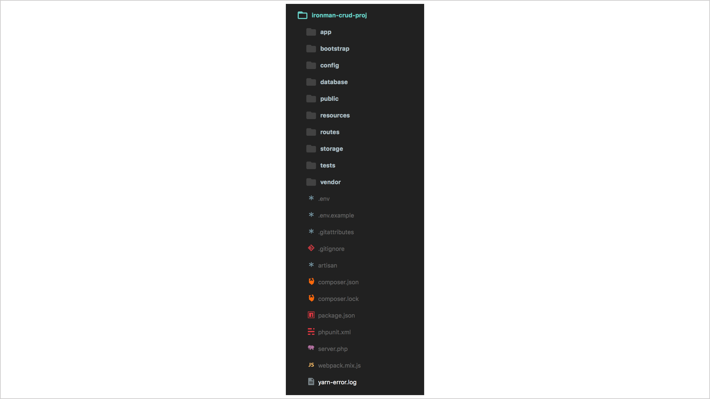
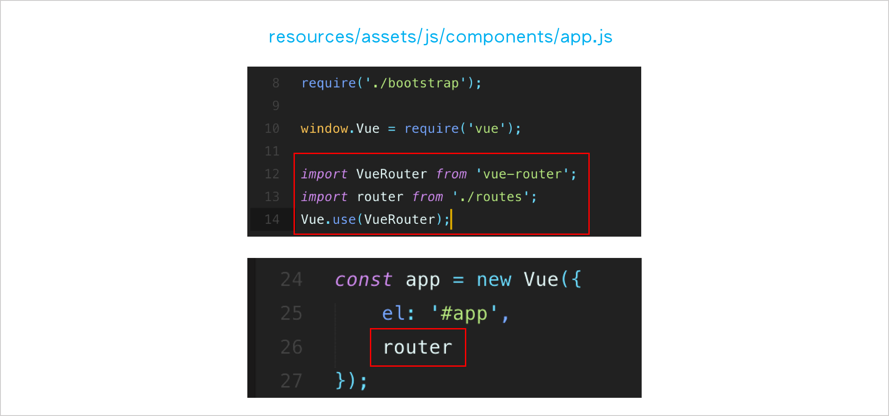

# Day27 - [實作App-簡易留言板(1)] 註冊登入功能

鐵人賽參賽到這邊，該是將這三個禮拜學到的概念好好發揮練功一下了，所以從今天開始到第30天最後一天，我會製作一個含有**CRUD**(Create, Read, Update, Delete)完整功能的**簡易留言板**，主要是做出**功能為主**，介面排版的部分可能先簡單為主，不求精緻了。我每天會自訂一些想完成的目標，文末會劃掉已完成的目標，如果沒有完成，會寫**[[ 未完待續 ]]**，最大的原因可能是時間來不及，也可能是遇到了bug，bug會盡量去找方法解決，找到解答會再把解法寫上來，如果有讀者知道怎麼解決的話，也可以回應留言跟我說喔，謝謝囉！

## 今日預定目標

* 建立一個全新Laravel專案
* 新增註冊頁面、完成註冊功能
* 新增登入頁面、完成登入功能

-----

### 小教學一下：使用Laravel Installer建立新專案

其實前面Day25有使用過composer建立過Laravel專案，今天我看到了另一種方法是使用**Laravel Installer**建立Laravel專案，下面我們來看看要怎麼使用**Laravel Installer**。

#### 1. 在終端機先執行安裝Laravel Installer

```
$ composer global require "laravel/installer"
```

#### 2. 安裝完後，將Laravel Installer加入環境變數(PATH)

* Mac系統：在終端機輸入以下指令

> [使用者名稱]記得更改

```
$ export PATH = $PATH:/Users/[使用者名稱]/.composer/vendor/bin

#查看系統中的$PATH(會看到剛剛新增的路徑會加在原有PATH後面)
$ echo $PATH
```

* Windows系統：控制台→系統及安全性→系統→進階系統設定(左側欄)→點選**環境變數**

在**Path**變數底下新增一新路徑，填入後按下完成即修改變數成功。

```
C:\Users\[使用者名稱]\AppData\Roaming\Composer\vendor\bin
```

此時就可以使用laravel指令操作了！

#### 3. 使用Laravel Installer建立新專案

> laravel指令建立專案比較簡單，不像composer這麼複雜。

差別在於使用composer建立出來的專案，會產生一個該Laravel專案的副本，所以在安裝時需要等比較久的時間。

```
$ laravel new [Project_name]
$ cd [Project_name]

#安裝node套件
$ npm install
```

好的，上面我們又學習到怎麼使用Laravel Installer建立新專案了，下面我們就開始寫我們的留言板專案吧！

## 開始寫CRUD專案 - 簡易留言板

### 建立一個全新Laravel專案

```
$ laravel new ironman-crud-proj
$ cd ironman-crud-proj
```

建立好的專案架構，參考下圖：



### 新增註冊頁面、完成註冊功能

先安裝vue-router套件，使用vue-router來管理路由。

```
$ npm install vue-router --save
```

修改`resources/assets/js/app.js`：




### 新增登入頁面、完成登入功能


-----

## 今日完成目標

* ~~建立一個全新Laravel專案~~
* 新增註冊頁面、完成註冊功能
* 新增登入頁面、完成登入功能

-----

### 參考資料

* [建立 Laravel 專案](https://tony915.gitbooks.io/laravel4/content/install/install_laravel.html)
